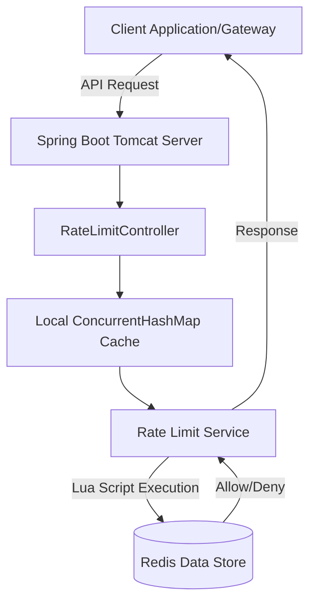

# System Architecture

The Rate Limiting Service is built on **Spring Boot** and **Redis** to provide high-performance, distributed, and highly available rate-limiting capabilities for applications and APIs.

## High-Level Design

At its core, the system acts as a middleware or standalone service that evaluates whether incoming requests exceed defined thresholds. The evaluation happens entirely in **Redis** via Lua scripts to ensure atomicity, minimize round trips, and eliminate race conditions across distributed clients.

## Core Components

### 1. RateLimitController
The main entry point for evaluation. It receives `POST /api/v1/rate-limit/check` requests containing a `clientKey` and an `identifier`.

### 2. Local Configuration Cache
To maximize throughput and avoid querying Redis twice per request (once for config, once for the algorithm state), the service caches the `Client` configuration in memory using a `ConcurrentHashMap` with a 30-second TTL (`CACHE_TTL_MS`).
- If a client's configuration changes via the Admin API, a `ClientConfigChangedEvent` is published.
- The controller listens for this event and instantly evicts the local cache for that specific `clientKey`.

### 3. Rate Limiting Services
The controller routes the request to either the `TokenBucketService` or `SlidingWindowService` based on the client's configured algorithm. These services handle passing the appropriate parameters (like `maxTokens`, `refillRate`, `window`) to the Redis template.

### 4. Redis Lua Scripts
The atomic heart of the rate limiter. Scripts like `token_bucket.lua` and `sliding_window.lua` are loaded into Redis and executed in a single atomic transaction. This guarantees that concurrent requests for the same identifier are processed sequentially and accurately.

## Advantages of this Architecture
- **Atomicity:** Lua scripts execute atomically in Redis, preventing race conditions where multiple requests might bypass the limit simultaneously.
- **Low Latency:** Combining the local configuration cache with single-trip Lua scripts results in sub-10ms evaluation times.
- **Distributed:** By relying on Redis as the central source of truth, multiple instances of the Rate Limiting Service can be deployed behind a load balancer without maintaining complex sticky sessions or distributed locks.
