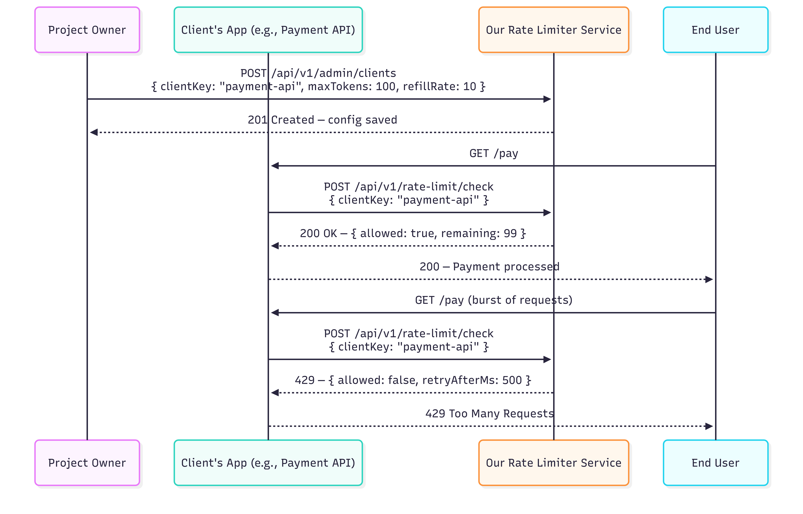

# Quick Start & Integration

This guide will help you run the Rate Limiting Service locally and integrate it into your client applications.

## Prerequisites
- **Java 21**
- **Maven**
- **Redis** running locally on port `6379`, or a remote Redis instance.

## 1. Local Setup
1. Clone the repository.
2. Ensure Redis is running (`redis-server`).
3. (Optional) Create a `.env` file in the root directory to override the default Redis connection string:
   ```env
   REDIS_URL=redis://localhost:6379
   PORT=8080
   ```
4. Run the application:
   ```bash
   ./mvnw spring-boot:run
   ```
   The service will start on `http://localhost:8080`.

## 2. Integration Guide

To protect your application's endpoints, you must first register your application as a "Client" in the Rate Limiting Service, and then intercept incoming requests to check the rate limit.

### Sequence Overview

The sequence below depicts how a client application (e.g., Payment API) registers its parameters and evaluates end-user traffic:




### Step A: Register your Application
Use the Admin API to register your application configuration.

```bash
curl -X POST http://localhost:8080/api/v1/admin/client/register \
-H "Content-Type: application/json" \
-d '{
  "clientKey": "my_public_api",
  "maxTokens": 100,
  "refillRate": 10,
  "algorithm": "TOKEN_BUCKET"
}'
```

### Step B: Intercept and Check Limits
In your application (e.g., in an API Gateway, Middleware, or Interceptor), extract the identifier (such as the user's IP Address or API Key) and call the Rate Limiting Service before processing the business logic.

**Example Pseudo-code:**
```javascript
async function rateLimitMiddleware(req, res, next) {
    const userIp = req.ip;
    
    // Call the Rate Limiting Service
    const response = await fetch('http://localhost:8080/api/v1/rate-limit/check', {
        method: 'POST',
        headers: { 'Content-Type': 'application/json' },
        body: JSON.stringify({
            clientKey: 'my_public_api',
            identifier: userIp
        })
    });
    
    const limitResult = await response.json();
    
    // Append standard RateLimit headers to the response
    res.setHeader('RateLimit-Limit', limitResult.maxTokens);
    res.setHeader('RateLimit-Remaining', limitResult.remaining);
    res.setHeader('RateLimit-Reset', Math.ceil(limitResult.resetAtEpochMs / 1000));
    
    if (response.status === 429 || limitResult.decision === 'DENY') {
        res.setHeader('Retry-After', Math.ceil(limitResult.retryAfterMs / 1000));
        return res.status(429).json({ error: "Too Many Requests" });
    }
    
    next();
}
```

By following this pattern, your backend application is protected from abusive traffic, and the rate limiting logic is decoupled into a dedicated, highly scalable service.
