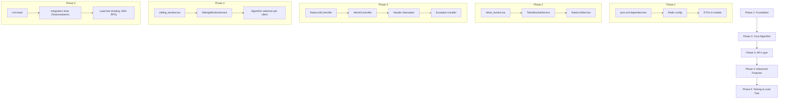

# Token Bucket Rate Limiter Service — Backend Implementation Plan

## Overview

Build a standalone Rate Limiter microservice in **Java Spring Boot 4.1** that exposes a REST API for rate-limiting decisions. Given a client key, the service returns ALLOW or DENY using a **Token Bucket** algorithm (with an optional **Sliding Window** mode). State is persisted in **Redis** for crash-survival and sub-millisecond latency, with concurrency handled via **Lua scripts** for atomic bucket operations.

---

## Tech Stack & Tools

| Layer | Technology | Why |
|---|---|---|
| **Framework** | Spring Boot 4.1 (already scaffolded) | Already in the project; mature REST support |
| **Language** | Java 17 | Already configured in `pom.xml` |
| **Database / State Store** | **Redis 7+** | Sub-ms reads/writes, atomic Lua scripting, TTL-based auto-expiry, perfect for rate-limit state that must survive restarts |
| **Redis Client** | **Spring Data Redis** (`spring-boot-starter-data-redis`) with Lettuce | Non-blocking, thread-safe, built-in connection pooling |
| **Serialization** | Jackson (ships with Spring Boot) | Request/response DTOs |
| **Boilerplate** | Lombok (already in `pom.xml`) | Reduce getter/setter noise |
| **Testing** | JUnit 5 + MockMvc + Testcontainers (Redis) | Integration tests with real Redis in Docker |
| **Load Testing** | **Gatling** (Maven plugin) or **Apache JMeter** | Req #07 — prove correctness under 500+ concurrent RPS |
| **Build** | Maven (already scaffolded) | Already in the project |

> [!IMPORTANT]
> **Why Redis over a relational DB?** Rate-limit state is ephemeral, high-frequency, and latency-sensitive. A relational DB (Postgres, MySQL) would add 1-5 ms per call and create write-contention bottlenecks under 500+ RPS. Redis gives <0.5 ms reads and **atomic Lua scripts** that eliminate race conditions without application-level locking. The TTL feature also auto-cleans expired buckets.

---

## User Review Required

> [!IMPORTANT]
> **Redis Hosting:** This plan assumes you'll run Redis locally via Docker during development (`docker run -p 6379:6379 redis:7-alpine`). Is this acceptable, or do you have a managed Redis instance you'd prefer to use?

> [!IMPORTANT]
> **Algorithm Default:** The plan implements Token Bucket as the default algorithm and Sliding Window Log as the alternative (selectable per client, as per Req #05). Are you happy with this pairing, or would you prefer Sliding Window Counter instead?

> [!IMPORTANT]
> **Authentication for Admin Endpoints:** The spec doesn't mention auth. Should the admin endpoints (creating/updating client limits) be protected with an API key, or is no authentication needed for now?

---

## Open Questions

> [!NOTE]
> **Stretch Goal — Distributed Mode:** The plan's Redis-based approach is inherently distributed (multiple app instances share the same Redis). Should we explicitly design for Redis Cluster / Sentinel from the start, or keep single-instance Redis for now?

> [!NOTE]
> **Stretch Goal — Dashboard:** The dashboard is marked as a stretch goal. Should we include WebSocket event publishing in the backend design now (so the dashboard can subscribe later), or defer entirely?

---

## Database Schema (Redis)

We'll use Redis keys (not tables) with the following structure:

```
# Per-client configuration (Hash)
rate_limit:config:{clientKey}
  ├── maxTokens        (int)     — bucket capacity / burst size
  ├── refillRate        (double)  — tokens added per second
  ├── algorithm         (string)  — "TOKEN_BUCKET" | "SLIDING_WINDOW"
  └── createdAt         (long)    — epoch millis

# Per-client bucket state (Hash) — for Token Bucket
rate_limit:bucket:{clientKey}
  ├── tokens            (double)  — current token count
  └── lastRefillTime    (long)    — epoch millis of last refill

# Per-client request log (Sorted Set) — for Sliding Window
rate_limit:window:{clientKey}
  └── members: request timestamps (score = epoch millis)
```

> [!TIP]
> Redis TTLs will be set on bucket/window keys to auto-expire idle clients (e.g., 2× the refill window), preventing unbounded memory growth.

---

## Proposed Changes

### 1. Dependencies (pom.xml)

#### [MODIFY] [pom.xml](file:///c:/Users/pranav/wd/project/rate/rate_limit/pom.xml)

Add the following Maven dependencies:

```xml
<!-- Redis -->
<dependency>
    <groupId>org.springframework.boot</groupId>
    <artifactId>spring-boot-starter-data-redis</artifactId>
</dependency>

<!-- Validation -->
<dependency>
    <groupId>org.springframework.boot</groupId>
    <artifactId>spring-boot-starter-validation</artifactId>
</dependency>

<!-- Testcontainers for integration tests -->
<dependency>
    <groupId>org.testcontainers</groupId>
    <artifactId>junit-jupiter</artifactId>
    <scope>test</scope>
</dependency>
<dependency>
    <groupId>org.springframework.boot</groupId>
    <artifactId>spring-boot-testcontainers</artifactId>
    <scope>test</scope>
</dependency>

<!-- Gatling for load testing -->
<dependency>
    <groupId>io.gatling.highcharts</groupId>
    <artifactId>gatling-charts-highcharts</artifactId>
    <version>3.11.5</version>
    <scope>test</scope>
</dependency>
```

---

### 2. Configuration

#### [MODIFY] [application.properties](file:///c:/Users/pranav/wd/project/rate/rate_limit/src/main/resources/application.properties)

Add Redis connection properties and default rate-limit settings.

#### [NEW] RedisConfig.java
`com.example.rate_limit.config.RedisConfig`

- Configure `RedisTemplate<String, String>` with appropriate serializers.
- Register Lua scripts as `RedisScript` beans.

#### [NEW] RateLimitProperties.java
`com.example.rate_limit.config.RateLimitProperties`

- `@ConfigurationProperties(prefix = "rate-limit")`
- Default max tokens, refill rate, algorithm — used when a client has no explicit config.

---

### 3. Domain Model (DTOs & Enums)

#### [NEW] `com.example.rate_limit.model.RateLimitAlgorithm` (Enum)
```java
public enum RateLimitAlgorithm {
    TOKEN_BUCKET,
    SLIDING_WINDOW
}
```

#### [NEW] `com.example.rate_limit.model.ClientConfig`
- `clientKey`, `maxTokens`, `refillRate`, `algorithm`, `createdAt`
- Lombok `@Data`, `@Builder`

#### [NEW] `com.example.rate_limit.dto.RateLimitRequest`
- `clientKey` (required)

#### [NEW] `com.example.rate_limit.dto.RateLimitResponse`
- `allowed` (boolean)
- `limit`, `remaining`, `retryAfterMs`, `resetAtEpochMs`

#### [NEW] `com.example.rate_limit.dto.ClientConfigRequest`
- `clientKey`, `maxTokens`, `refillRate`, `algorithm` (with `@Valid` constraints)

#### [NEW] `com.example.rate_limit.dto.ClientConfigResponse`
- Mirrors `ClientConfig` for API responses

---

### 4. Core Algorithm — Lua Scripts (Atomic Operations)

> [!IMPORTANT]
> **This is the heart of the service.** Lua scripts execute atomically inside Redis, eliminating race conditions without distributed locks. This satisfies **Req #04** (concurrent requests for the same client key must be race-condition safe).

#### [NEW] `src/main/resources/scripts/token_bucket.lua`

Pseudocode:
```
1. HGETALL rate_limit:bucket:{key}
2. Calculate elapsed time since lastRefillTime
3. Compute tokens to add = elapsed × refillRate
4. newTokens = min(currentTokens + added, maxTokens)
5. If newTokens >= 1:
     decrement, update lastRefillTime, return ALLOWED + remaining
   Else:
     return DENIED + time until next token
6. Set TTL on the key
```

#### [NEW] `src/main/resources/scripts/sliding_window.lua`

Pseudocode:
```
1. ZREMRANGEBYSCORE — remove entries older than window
2. ZCARD — count remaining entries
3. If count < maxRequests:
     ZADD current timestamp
     return ALLOWED + remaining
   Else:
     return DENIED + oldest entry expiry time
4. Set TTL on the key
```

---

### 5. Service Layer

#### [NEW] `com.example.rate_limit.service.RateLimitService`

The central orchestrator:

```java
public RateLimitResponse checkRateLimit(String clientKey) {
    // 1. Fetch client config from Redis (or use defaults)
    // 2. Delegate to appropriate algorithm
    // 3. Build response with rate-limit headers
}
```

#### [NEW] `com.example.rate_limit.service.TokenBucketService`

- Executes `token_bucket.lua` via `RedisTemplate.execute(RedisScript, ...)`
- Parses Lua return values into `RateLimitResponse`

#### [NEW] `com.example.rate_limit.service.SlidingWindowService`

- Executes `sliding_window.lua` via `RedisTemplate.execute(RedisScript, ...)`
- Parses Lua return values into `RateLimitResponse`

#### [NEW] `com.example.rate_limit.service.ClientConfigService`

- CRUD operations for per-client configuration in Redis
- Uses `RedisTemplate` hash operations on `rate_limit:config:{clientKey}`

---

### 6. Controller Layer (REST API)

#### [DELETE] [HelloWorldController.java](file:///c:/Users/pranav/wd/project/rate/rate_limit/src/main/java/com/example/rate_limit/HelloWorldController.java)

Remove the placeholder controller.

#### [NEW] `com.example.rate_limit.controller.RateLimitController`

| Method | Endpoint | Description | Req |
|---|---|---|---|
| `POST` | `/api/v1/rate-limit/check` | Check if request is ALLOW/DENY | #01 |
| `GET` | `/api/v1/rate-limit/check/{clientKey}` | Lightweight GET variant | #01 |

- Returns `200 OK` with `RateLimitResponse` body for ALLOW
- Returns `429 Too Many Requests` for DENY
- Sets standard rate-limit headers on **every** response (#06):
  - `X-RateLimit-Limit`
  - `X-RateLimit-Remaining`
  - `X-RateLimit-Reset`
  - `Retry-After` (on 429 only)

#### [NEW] `com.example.rate_limit.controller.AdminController`

| Method | Endpoint | Description | Req |
|---|---|---|---|
| `POST` | `/api/v1/admin/clients` | Create/update client config | #02 |
| `GET` | `/api/v1/admin/clients/{clientKey}` | Get client config | #02 |
| `DELETE` | `/api/v1/admin/clients/{clientKey}` | Delete client config | #02 |
| `GET` | `/api/v1/admin/clients` | List all client configs | #02 |

---

### 7. Response Headers Interceptor

#### [NEW] `com.example.rate_limit.interceptor.RateLimitHeaderInterceptor`

- A `HandlerInterceptor` that reads rate-limit metadata from a `ThreadLocal` or request attribute and sets the standard headers on the `HttpServletResponse`.
- This ensures **every** response includes the headers, even error responses (#06).

---

### 8. Exception Handling

#### [NEW] `com.example.rate_limit.exception.GlobalExceptionHandler`

- `@ControllerAdvice` to handle:
  - `RateLimitExceededException` → 429 with rate-limit headers
  - `ClientNotFoundException` → 404
  - `ValidationException` → 400
  - Generic fallback → 500

#### [NEW] `com.example.rate_limit.exception.RateLimitExceededException`
#### [NEW] `com.example.rate_limit.exception.ClientNotFoundException`

---

### 9. Health & Monitoring

#### [NEW] Health indicator

- A custom `HealthIndicator` that pings Redis to ensure the store is reachable.
- Add `spring-boot-starter-actuator` dependency for `/actuator/health`.

---

## Project Package Structure (Final)

```
com.example.rate_limit
├── RateLimitApplication.java
├── config/
│   ├── RedisConfig.java
│   └── RateLimitProperties.java
├── controller/
│   ├── RateLimitController.java
│   └── AdminController.java
├── dto/
│   ├── RateLimitRequest.java
│   ├── RateLimitResponse.java
│   ├── ClientConfigRequest.java
│   └── ClientConfigResponse.java
├── model/
│   ├── RateLimitAlgorithm.java
│   └── ClientConfig.java
├── service/
│   ├── RateLimitService.java
│   ├── TokenBucketService.java
│   ├── SlidingWindowService.java
│   └── ClientConfigService.java
├── exception/
│   ├── GlobalExceptionHandler.java
│   ├── RateLimitExceededException.java
│   └── ClientNotFoundException.java
├── interceptor/
│   └── RateLimitHeaderInterceptor.java
└── health/
    └── RedisHealthIndicator.java

src/main/resources/
├── application.properties
└── scripts/
    ├── token_bucket.lua
    └── sliding_window.lua
```

---

## Implementation Order



| Phase | What | Estimated Files |
|---|---|---|
| **Phase 1** | Dependencies, Redis config, DTOs, models | 7 files |
| **Phase 2** | Lua scripts, TokenBucketService, RateLimitService | 4 files |
| **Phase 3** | Controllers, interceptor, exception handler | 5 files |
| **Phase 4** | Sliding window Lua + service, algorithm selection | 2 files |
| **Phase 5** | Unit tests, integration tests, Gatling load test | 4+ files |

---

## Requirements Traceability

| Req | Solution |
|---|---|
| **#01** ALLOW/DENY endpoint (token bucket) | `RateLimitController` + `TokenBucketService` + `token_bucket.lua` |
| **#02** Per-client configurable limits via admin | `AdminController` + `ClientConfigService` + Redis hash storage |
| **#03** State survives restart | Redis persistence (RDB/AOF) — state lives outside the JVM |
| **#04** Race-condition safe concurrency | Lua scripts execute atomically in Redis — no double-spend |
| **#05** Sliding window mode, selectable per client | `SlidingWindowService` + `sliding_window.lua` + `algorithm` field in client config |
| **#06** Standard rate-limit headers on every response | `RateLimitHeaderInterceptor` + response DTOs |
| **#07** Load test proving 500+ concurrent RPS | Gatling simulation class |

---

## Verification Plan

### Automated Tests
1. **Unit tests** — Service layer logic with mocked Redis
   ```bash
   ./mvnw test -Dtest="*ServiceTest"
   ```
2. **Integration tests** — Full stack with Testcontainers Redis
   ```bash
   ./mvnw test -Dtest="*IntegrationTest"
   ```
3. **Load test** — Gatling simulation targeting 500+ concurrent users
   ```bash
   ./mvnw gatling:test
   ```

### Manual Verification
- Start Redis via `docker run -p 6379:6379 redis:7-alpine`
- Start the app via `./mvnw spring-boot:run`
- Use `curl` or Postman to:
  1. Create a client config via `POST /api/v1/admin/clients`
  2. Hit `POST /api/v1/rate-limit/check` repeatedly and observe ALLOW → DENY transition
  3. Verify `X-RateLimit-*` headers in every response
  4. Restart the app and verify state persists
  5. Switch a client to `SLIDING_WINDOW` and repeat
